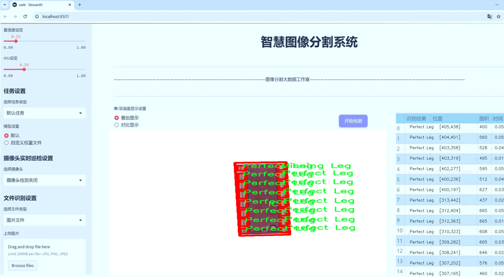
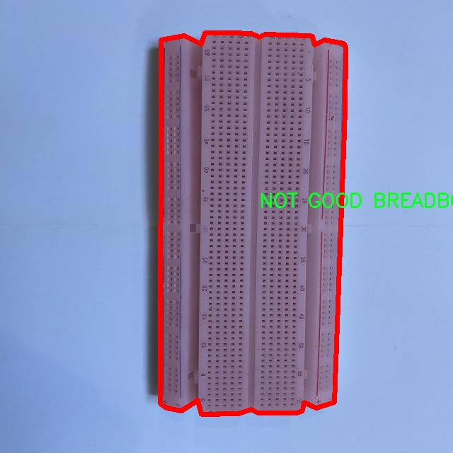

# 电子元件缺陷分割系统源码＆数据集分享
 [yolov8-seg-repvit＆yolov8-seg-efficientViT等50+全套改进创新点发刊_一键训练教程_Web前端展示]

### 1.研究背景与意义

项目参考[ILSVRC ImageNet Large Scale Visual Recognition Challenge](https://gitee.com/YOLOv8_YOLOv11_Segmentation_Studio/projects)

项目来源[AAAI Global Al lnnovation Contest](https://kdocs.cn/l/cszuIiCKVNis)

研究背景与意义

随着电子技术的迅猛发展，电子元件的广泛应用使得其质量控制和缺陷检测变得愈发重要。电子元件在各类电子设备中的关键作用，促使制造商必须确保产品的高可靠性和稳定性。传统的人工检测方法不仅效率低下，而且容易受到人为因素的影响，导致漏检和误判的情况频繁发生。因此，开发高效、准确的自动化缺陷检测系统显得尤为迫切。近年来，深度学习技术的迅猛发展为图像处理和计算机视觉领域带来了新的机遇，尤其是在目标检测和分割任务中表现出色。

YOLO（You Only Look Once）系列模型因其高效的实时检测能力和较高的准确率，已成为目标检测领域的热门选择。YOLOv8作为该系列的最新版本，结合了多种先进的深度学习技术，具备了更强的特征提取能力和更快的推理速度。然而，尽管YOLOv8在目标检测方面表现优异，但在电子元件缺陷分割任务中仍存在一定的局限性，尤其是在处理复杂背景和小目标时。因此，基于YOLOv8的改进，构建一个专门针对电子元件缺陷的分割系统，将有助于提升缺陷检测的准确性和效率。

本研究的目标是开发一个基于改进YOLOv8的电子元件缺陷分割系统，利用4800张图像和15个类别的丰富数据集进行训练和测试。该数据集涵盖了多种电子元件的良品和缺陷样本，包括Arduino、电池、面包板、集成电路（IC）、电阻器等，能够为模型提供多样化的学习样本。通过对不同类别的缺陷进行精确分割，系统将能够自动识别和定位缺陷，提高检测的全面性和准确性。

在研究意义上，本项目不仅能够推动电子元件缺陷检测技术的发展，还将为相关领域的研究提供新的思路和方法。通过改进YOLOv8，研究将探讨如何利用深度学习技术提升缺陷检测的精度和效率，尤其是在处理复杂背景和小目标时的表现。此外，系统的成功应用将为电子制造业的自动化检测提供实用的解决方案，降低人工成本，提高生产效率，进而提升产品质量。

综上所述，基于改进YOLOv8的电子元件缺陷分割系统的研究具有重要的理论价值和实际意义。它不仅能够推动深度学习在工业应用中的发展，还将为电子元件的质量控制提供有力的技术支持，助力制造业的智能化转型。通过这一研究，我们期望能够为电子元件的自动化检测提供新的解决方案，促进电子产业的健康发展。

### 2.图片演示





##### 注意：由于此博客编辑较早，上面“2.图片演示”和“3.视频演示”展示的系统图片或者视频可能为老版本，新版本在老版本的基础上升级如下：（实际效果以升级的新版本为准）

  （1）适配了YOLOV8的“目标检测”模型和“实例分割”模型，通过加载相应的权重（.pt）文件即可自适应加载模型。

  （2）支持“图片识别”、“视频识别”、“摄像头实时识别”三种识别模式。

  （3）支持“图片识别”、“视频识别”、“摄像头实时识别”三种识别结果保存导出，解决手动导出（容易卡顿出现爆内存）存在的问题，识别完自动保存结果并导出到tempDir中。

  （4）支持Web前端系统中的标题、背景图等自定义修改，后面提供修改教程。

  另外本项目提供训练的数据集和训练教程,暂不提供权重文件（best.pt）,需要您按照教程进行训练后实现图片演示和Web前端界面演示的效果。

### 3.视频演示

[3.1 视频演示](https://www.bilibili.com/video/BV1RP2hYeE4j/)

### 4.数据集信息展示

##### 4.1 本项目数据集详细数据（类别数＆类别名）

nc: 16
names: ['GOOD ARDUINO', 'GOOD BATTERY', 'GOOD BREADBOARD', 'GOOD IC', 'GOOD RESISTOR', 'IC', 'IC-DefectLeg', 'IC-Leg', 'Missing Leg', 'NOT GOOD ARDUINO', 'NOT GOOD BATTERY', 'NOT GOOD BREADBOARD', 'NOT GOOD IC', 'NOT GOOD RESISTOR', 'Perfect Leg', 'undefined']


##### 4.2 本项目数据集信息介绍

数据集信息展示

在本研究中，我们使用了名为“Defect”的数据集，以训练和改进YOLOv8-seg模型，旨在实现电子元件缺陷的高效分割。该数据集包含16个类别，涵盖了电子元件的不同状态和缺陷类型，具体类别包括：GOOD ARDUINO、GOOD BATTERY、GOOD BREADBOARD、GOOD IC、GOOD RESISTOR、IC、IC-DefectLeg、IC-Leg、Missing Leg、NOT GOOD ARDUINO、NOT GOOD BATTERY、NOT GOOD BREADBOARD、NOT GOOD IC、NOT GOOD RESISTOR、Perfect Leg以及undefined。这些类别的设计旨在全面覆盖电子元件的良品与缺陷状态，以便于模型在训练过程中能够学习到各种可能的缺陷特征。

在数据集的构建过程中，研究团队对每个类别进行了细致的标注和分类。良品类别（如GOOD ARDUINO、GOOD BATTERY等）代表了在生产过程中经过严格质量检测的电子元件，这些元件在功能和外观上均符合标准。而缺陷类别则涵盖了从轻微缺陷到严重缺陷的多种情况，例如IC-DefectLeg和Missing Leg，前者可能指的是集成电路引脚的缺损，后者则是指某个元件的引脚缺失。这种细致的分类不仅有助于模型识别和分割缺陷，还能为后续的质量控制和改进提供重要的数据支持。

数据集中的“undefined”类别则是为了处理那些难以归类的样本，这些样本可能由于拍摄角度、光照条件或其他因素导致无法明确判断其状态。通过引入这一类别，模型能够更好地应对现实场景中的不确定性，提高其在实际应用中的鲁棒性。

为了确保数据集的多样性和代表性，研究团队在不同的环境和条件下收集了大量样本，涵盖了不同品牌和型号的电子元件。这一过程不仅包括了标准的生产线产品，还涉及到一些可能因人为因素或环境影响而产生缺陷的元件。通过这种方式，数据集不仅具备了丰富的样本量，还确保了各类别之间的均衡分布，为模型的训练提供了坚实的基础。

在数据预处理阶段，所有样本均经过了标准化处理，以消除不同拍摄条件对图像质量的影响。此外，数据增强技术的应用也极大地丰富了训练数据集，提升了模型的泛化能力。通过旋转、缩放、翻转等操作，研究团队能够生成多样化的训练样本，使得模型在面对真实世界中的各种变换时，依然能够保持较高的识别精度。

总之，“Defect”数据集为本研究提供了一个全面而丰富的基础，涵盖了电子元件的多种状态与缺陷类型。通过对这些数据的深入分析与处理，我们期望能够有效提升YOLOv8-seg模型在电子元件缺陷分割任务中的表现，为未来的智能制造和质量控制提供有力支持。




### 5.全套项目环境部署视频教程（零基础手把手教学）

[5.1 环境部署教程链接（零基础手把手教学）](https://www.bilibili.com/video/BV1jG4Ve4E9t/?vd_source=bc9aec86d164b67a7004b996143742dc)


[5.2 安装Python虚拟环境创建和依赖库安装视频教程链接（零基础手把手教学）](https://www.bilibili.com/video/BV1nA4VeYEze/?vd_source=bc9aec86d164b67a7004b996143742dc)

### 6.手把手YOLOV8-seg训练视频教程（零基础小白有手就能学会）

[6.1 手把手YOLOV8-seg训练视频教程（零基础小白有手就能学会）](https://www.bilibili.com/video/BV1cA4VeYETe/?vd_source=bc9aec86d164b67a7004b996143742dc)


按照上面的训练视频教程链接加载项目提供的数据集，运行train.py即可开始训练



     Epoch   gpu_mem       box       obj       cls    labels  img_size
     1/200     0G   0.01576   0.01955  0.007536        22      1280: 100%|██████████| 849/849 [14:42<00:00,  1.04s/it]
               Class     Images     Labels          P          R     mAP@.5 mAP@.5:.95: 100%|██████████| 213/213 [01:14<00:00,  2.87it/s]
                 all       3395      17314      0.994      0.957      0.0957      0.0843

     Epoch   gpu_mem       box       obj       cls    labels  img_size
     2/200     0G   0.01578   0.01923  0.007006        22      1280: 100%|██████████| 849/849 [14:44<00:00,  1.04s/it]
               Class     Images     Labels          P          R     mAP@.5 mAP@.5:.95: 100%|██████████| 213/213 [01:12<00:00,  2.95it/s]
                 all       3395      17314      0.996      0.956      0.0957      0.0845

     Epoch   gpu_mem       box       obj       cls    labels  img_size
     3/200     0G   0.01561    0.0191  0.006895        27      1280: 100%|██████████| 849/849 [10:56<00:00,  1.29it/s]
               Class     Images     Labels          P          R     mAP@.5 mAP@.5:.95: 100%|███████   | 187/213 [00:52<00:00,  4.04it/s]
                 all       3395      17314      0.996      0.957      0.0957      0.0845


### 7.50+种全套YOLOV8-seg创新点代码加载调参视频教程（一键加载写好的改进模型的配置文件）

[7.1 50+种全套YOLOV8-seg创新点代码加载调参视频教程（一键加载写好的改进模型的配置文件）](https://www.bilibili.com/video/BV1Hw4VePEXv/?vd_source=bc9aec86d164b67a7004b996143742dc)

### 8.YOLOV8-seg图像分割算法原理

原始YOLOv8-seg算法原理

YOLOv8-seg算法是目标检测领域中的一项重要进展，其设计理念和实现方法在YOLO系列算法的基础上进行了创新和优化。作为YOLOv5团队最新推出的SOTA（State of the Art）算法，YOLOv8-seg不仅延续了YOLOv5和YOLOv7的优良特性，还引入了多项新功能和改进，使其在目标检测和分割任务中表现出色。

YOLOv8-seg的网络结构主要由输入层、主干网络、特征融合层和解耦头组成。输入层负责将输入图像转换为640x640的RGB格式，并进行数据预处理。YOLOv8-seg在数据预处理阶段采用了YOLOv5的策略，包括马赛克增强、混合增强、空间扰动和颜色扰动等方法，以增强模型的鲁棒性和泛化能力。经过预处理的图像将被送入主干网络进行特征提取。

在主干网络方面，YOLOv8-seg继续采用了YOLOv5的CSPDarknet架构，但对其进行了改进。具体而言，YOLOv8-seg将YOLOv5中的C3模块替换为C2f模块，C2f模块在设计上引入了ELAN（Efficient Layer Aggregation Network）思想，旨在提高特征提取的效率和效果。C2f模块由多个CBS（Convolution + Batch Normalization + SiLU）卷积模块和若干个Bottleneck构成，具有两个分支结构，能够有效地缓解深层网络中的梯度消失问题，并增强浅层特征的重用能力。

特征融合层采用了PAN-FPN（Path Aggregation Network with Feature Pyramid Network）结构，旨在实现多尺度特征的深度融合。YOLOv8-seg在特征融合过程中，首先通过自下而上的方式将高层特征与中层和浅层特征进行融合，随后再通过自上而下的方式将融合后的特征传递至解耦头。此过程确保了不同层次的特征能够充分结合，从而提高目标检测的准确性。

YOLOv8-seg的解耦头部分借鉴了YOLOX和YOLOv6的设计，采用了Anchor-Free的思想，取消了传统的Anchor-Base结构。这一改变使得YOLOv8-seg在目标检测时能够更灵活地处理不同尺寸和形状的目标。解耦头的输出特征图分为多个尺度，分别对应于不同的检测任务，包括边框回归和目标分类。具体而言，YOLOv8-seg的Head部分通过特征图的拼接和维度变换，输出类别预测和边框预测结果，确保模型能够准确识别和定位目标。

在损失函数的设计上，YOLOv8-seg采用了VFLLoss作为分类损失，DFLLoss和CIoULoss作为边框回归损失。这种组合损失函数的设计旨在提高模型的训练效率和检测精度，尤其是在面对样本不平衡和困难样本时。YOLOv8-seg还引入了Task-Aligned的样本匹配策略，取代了传统的静态匹配方式，使得训练过程更加灵活和高效。

值得一提的是，YOLOv8-seg在处理小目标和复杂场景时表现尤为突出。这得益于其特征融合层和解耦头的设计，使得模型能够充分利用多尺度特征信息，提升对小目标的检测能力。此外，YOLOv8-seg在训练过程中通过使用Focal Loss损失函数，有效解决了正负样本不平衡的问题，从而提高了模型的收敛速度和检测精度。

总的来说，YOLOv8-seg算法通过对YOLO系列算法的不断优化和创新，形成了一种高效、准确的目标检测和分割方案。其在主干网络、特征融合、解耦头和损失函数等多个方面的改进，使得YOLOv8-seg在目标检测任务中展现出强大的性能，成为当前目标检测领域的重要工具。随着YOLOv8-seg的不断发展和应用，其在实际场景中的表现将进一步推动目标检测技术的进步，为各类应用提供更为精准和高效的解决方案。


### 9.系统功能展示（检测对象为举例，实际内容以本项目数据集为准）

图9.1.系统支持检测结果表格显示

  图9.2.系统支持置信度和IOU阈值手动调节

  图9.3.系统支持自定义加载权重文件best.pt(需要你通过步骤5中训练获得)

  图9.4.系统支持摄像头实时识别

  图9.5.系统支持图片识别

  图9.6.系统支持视频识别

  图9.7.系统支持识别结果文件自动保存

  图9.8.系统支持Excel导出检测结果数据


### 10.50+种全套YOLOV8-seg创新点原理讲解（非科班也可以轻松写刊发刊，V11版本正在科研待更新）

#### 10.1 由于篇幅限制，每个创新点的具体原理讲解就不一一展开，具体见下列网址中的创新点对应子项目的技术原理博客网址【Blog】：


[10.1 50+种全套YOLOV8-seg创新点原理讲解链接](https://gitee.com/qunmasj/good)

#### 10.2 部分改进模块原理讲解(完整的改进原理见上图和技术博客链接)【如果此小节的图加载失败可以通过CSDN或者Github搜索该博客的标题访问原始博客，原始博客图片显示正常】
### 深度学习基础
卷积神经网络通过使用具有共享参数的卷积运算显著降低了模型的计算开销和复杂性。在LeNet、AlexNet和VGG等经典网络的驱动下，卷积神经网络现在已经建立了一个完整的系统，并在深度学习领域形成了先进的卷积神经网络模型。

感受野注意力卷积RFCBAMConv的作者在仔细研究了卷积运算之后获得了灵感。对于分类、目标检测和语义分割任务，一方面，图像中不同位置的对象的形状、大小、颜色和分布是可变的。在卷积操作期间，卷积核在每个感受野中使用相同的参数来提取信息，而不考虑来自不同位置的差分信息。这限制了网络的性能，这已经在最近的许多工作中得到了证实。

另一方面，卷积运算没有考虑每个特征的重要性，这进一步影响了提取特征的有效性，并最终限制了模型的性能。此外，注意力机制允许模型专注于重要特征，这可以增强特征提取的优势和卷积神经网络捕获详细特征信息的能力。因此，注意力机制在深度学习中得到了广泛的应用，并成功地应用于各个领域。

通过研究卷积运算的内在缺陷和注意力机制的特点，作者认为现有的空间注意力机制从本质上解决了卷积运算的参数共享问题，但仍局限于对空间特征的认知。对于较大的卷积核，现有的空间注意力机制并没有完全解决共享参数的问题。此外，他们无法强调感受野中每个特征的重要性，例如现有的卷积块注意力模块（CBAM）和 Coordinate注意力（CA）。

因此，[参考该博客提出了一种新的感受野注意力机制（RFA）](https://qunmasj.com)，它完全解决了卷积核共享参数的问题，并充分考虑了感受野中每个特征的重要性。通过RFA设计的卷积运算（RFAConv）是一种新的卷积运算，可以取代现有神经网络中的标准卷积运算。RFAConv通过添加一些参数和计算开销来提高网络性能。

大量关于Imagnet-1k、MS COCO和VOC的实验已经证明了RFAConv的有效性。作为一种由注意力构建的新型卷积运算，它超过了由CAM、CBAM和CA构建的卷积运算（CAMConv、CBAMConv、CAConv）以及标准卷积运算。

此外，为了解决现有方法提取感受野特征速度慢的问题，提出了一种轻量级操作。在构建RFAConv的过程中，再次设计了CA和CBAM的升级版本，并进行了相关实验。作者认为当前的空间注意力机制应该将注意力放在感受野空间特征上，以促进当前空间注意力机制的发展，并再次增强卷积神经网络架构的优势。


### 卷积神经网络架构
出色的神经网络架构可以提高不同任务的性能。卷积运算作为卷积神经网络的一种基本运算，推动了人工智能的发展，并为车辆检测、无人机图像、医学等先进的网络模型做出了贡献。He等人认为随着网络深度的增加，该模型将变得难以训练并产生退化现象，因此他们提出了残差连接来创新卷积神经网络架构的设计。Huang等人通过重用特征来解决网络梯度消失问题，增强了特征信息，他们再次创新了卷积神经网络架构。

通过对卷积运算的详细研究，Dai等人认为，具有固定采样位置的卷积运算在一定程度上限制了网络的性能，因此提出了Deformable Conv，通过学习偏移来改变卷积核的采样位置。在Deformable Conv的基础上，再次提出了Deformable Conv V2和Deformable Conv V3，以提高卷积网络的性能。

Zhang等人注意到，组卷积可以减少模型的参数数量和计算开销。然而，少于组内信息的交互将影响最终的网络性能。1×1的卷积可以与信息相互作用。然而，这将带来更多的参数和计算开销，因此他们提出了无参数的“通道Shuffle”操作来与组之间的信息交互。

Ma等人通过实验得出结论，对于参数较少的模型，推理速度不一定更快，对于计算量较小的模型，推理也不一定更快。经过仔细研究提出了Shufflenet V2。

YOLO将输入图像划分为网格，以预测对象的位置和类别。经过不断的研究，已经提出了8个版本的基于YOLO的目标检测器，如YOLOv5、YOLOv7、YOLOv8等。上述卷积神经网络架构已经取得了巨大的成功。然而，它们并没有解决提取特征过程中的参数共享问题。本文的工作从注意力机制开始，从一个新的角度解决卷积参数共享问题。

### 注意力机制
注意力机制被用作一种提高网络模型性能的技术，使其能够专注于关键特性。注意力机制理论已经在深度学习中建立了一个完整而成熟的体系。Hu等人提出了一种Squeeze-and-Excitation（SE）块，通过压缩特征来聚合全局通道信息，从而获得与每个通道对应的权重。Wang等人认为，当SE与信息交互时，单个通道和权重之间的对应关系是间接的，因此设计了高效通道注Efficient Channel Attention力（ECA），并用自适应kernel大小的一维卷积取代了SE中的全连接（FC）层。Woo等人提出了卷积块注意力模块（CBAM），它结合了通道注意力和空间注意力。作为一个即插即用模块，它可以嵌入卷积神经网络中，以提高网络性能。

尽管SE和CBAM已经提高了网络的性能。Hou等人仍然发现压缩特征在SE和CBAM中丢失了太多信息。因此，他们提出了轻量级Coordinate注意力（CA）来解决SE和CBAM中的问题。Fu等人计了一个空间注意力模块和通道注意力模块，用于扩展全卷积网络（FCN），分别对空间维度和通道维度的语义相关性进行建模。Zhang等人在通道上生成不同尺度的特征图，以建立更有效的通道注意力机制。

本文从一个新的角度解决了标准卷积运算的参数共享问题。这就是将注意力机制结合起来构造卷积运算。尽管目前的注意力机制已经获得了良好的性能，但它们仍然没有关注感受野的空间特征。因此，设计了具有非共享参数的RFA卷积运算，以提高网络的性能。


#### 回顾标准卷积
以标准卷积运算为基础构建卷积神经网络，通过共享参数的滑动窗口提取特征信息，解决了全连接层构建的神经网络的固有问题（即参数数量大、计算开销高）。

设表示输入特征图，其中、和分别表示特征图的通道数、高度和宽度。为了能够清楚地展示卷积核提取特征信息的过程，以为例。提取每个感受野slider的特征信息的卷积运算可以表示如下：


这里，表示在每次卷积slider操作之后获得的值，表示在每个slider内的相应位置处的像素值。表示卷积核，表示卷积核中的参数数量，表示感受野slider的总数。

可以看出，每个slider内相同位置的特征共享相同的参数。因此，标准的卷积运算无法感知不同位置带来的差异信息，这在一定程度上限制了卷积神经网络的性能。

#### 回顾空间注意力
目前，空间注意力机制使用通过学习获得的注意力图来突出每个特征的重要性。与上一节类似，以为例。突出关键特征的空间注意力机制可以简单地表达如下：


这里，表示在加权运算之后获得的值。和分别表示输入特征图和学习注意力图在不同位置的值，是输入特征图的高度和宽度的乘积，表示像素值的总数。一般来说，整个过程可以简单地表示在图1中。


#### 空间注意力与标准卷积
众所周知，将注意力机制引入卷积神经网络可以提高网络的性能。通过标准的卷积运算和对现有空间注意力机制的仔细分析。作者认为空间注意力机制本质上解决了卷积神经网络的固有缺点，即共享参数的问题。

目前，该模型最常见的卷积核大小为1×1和3×3。引入空间注意力机制后用于提取特征的卷积操作是1×1或3×3卷积操作。这个过程可以直观地显示出来。空间注意力机制被插入到1×1卷积运算的前面。通过注意力图对输入特征图进行加权运算（Re-weight“×”），最后通过1×1卷积运算提取感受野的slider特征信息。

整个过程可以简单地表示如下：


 

这里，卷积核仅表示一个参数值。如果将的值作为一个新的卷积核参数，那么有趣的是，通过1×1卷积运算提取特征时的参数共享问题得到了解决。然而，空间注意力机制的传说到此结束。当空间注意力机制被插入到3×3卷积运算的前面时。具体情况如下：


如上所述，如果取的值。作为一种新的卷积核参数，上述方程完全解决了大规模卷积核的参数共享问题。然而，最重要的一点是，卷积核在每个感受野slider中提取将共享部分特征的特征。换句话说，在每个感受野slider内都会有重叠。

经过仔细分析发现，，…，空间注意力图的权重在每个slider内共享。因此，空间注意机制不能解决大规模卷积核共享参数的问题，因为它们不注意感受野的空间特征。在这种情况下，空间注意力机制是有限的。
#### 创新空间注意力与标准卷积
RFA是为了解决空间注意力机制问题而提出的，创新了空间注意力。使用与RFA相同的思想，一系列空间注意力机制可以再次提高性能。RFA设计的卷积运算可以被视为一种轻量级的即插即用模块，以取代标准卷积，从而提高卷积神经网络的性能。因此，作者认为空间注意力机制和标准卷积在未来将有一个新的春天。

感受野的空间特征：

现在给出感受野空间特征的定义。它是专门为卷积核设计的，并根据kernel大小动态生成，如图2所示，以3×3卷积核为例。


在图2中，“空间特征”表示原始特征图，等于空间特征。“感受野空间特征”表示变换后的特征，该特征由每个感受野slider滑块组成，并且不重叠。也就是说，“感受野空间特征”中的每个3×3大小的slider表示提取原始3×3卷积特征时所有感觉野slider的特征。

#### 感受野注意力卷积(RFA):

关于感受野空间特征，该博客的作者提出了感受野注意（RFA），它不仅强调了感受野slider内各种特征的重要性，而且还关注感受野空间特性，以彻底解决卷积核参数共享的问题。感受野空间特征是根据卷积核的大小动态生成的，因此，RFA是卷积的固定组合，不能脱离卷积运算的帮助，卷积运算同时依赖RFA来提高性能。

因此，作者提出了感受野注意力卷积（RFAConv）。具有3×3大小卷积核的RFAConv的总体结构如图3所示。


目前，提取感受野特征最常用的方法速度较慢，因此经过不断探索提出了一种快速的方法，通过分组卷积来取代原来的方法。

具体来说，根据感受野大小，使用相应的组卷积大小来动态生成展开特征。尽管与原始的无参数方法（如Pytorch提供的nn.Unfld()）相比，该方法添加了一些参数，但速度要快得多。

注意：正如在上一节中提到的，当原始的3×3卷积核提取特征时，感受野空间特征中的每个3×3大小的窗口表示所有感受野滑块的特征。但在快速分组卷积提取感受野特征后，由于原始方法太慢，它们会被映射到新的特征中。

最近的一些工作已经证明信息交互可以提高网络性能。类似地，对于RFAConv，与感受野特征信息交互以学习注意力图可以提高网络性能，但与每个感受野特征交互将带来额外的计算开销。为了确保少量的计算开销和参数数量，通过探索使用AvgPool池化每个感受野特征的全局信息，然后通过1×1组卷积运算与信息交互。最后，softmax用于强调感受野特征中每个特征的重要性。通常，RFA的计算可以表示为：


表示分组卷积，表示卷积核的大小，代表规范化，表示输入特征图，是通过将注意力图与变换的感受野空间特征相乘而获得的。

与CBAM和CA不同，RFA可以为每个感受野特征生成注意力图。标准卷积受到卷积神经网络性能的限制，因为共享参数的卷积运算对位置带来的差异信息不敏感。RFA完全可以解决这个问题，具体细节如下：


由于RFA获得的特征图是“调整形状”后不重叠的感受野空间特征，因此通过池化每个感受野滑块的特征信息来学习学习的注意力图。换句话说，RFA学习的注意力图不再在每个感受野slider内共享，并且是有效的。这完全解决了现有的CA和CBAM对大尺寸kernel的注意力机制中的参数共享问题。

同时，RFA给标准卷积核带来了相当大的好处，但调整形状后，特征的高度和宽度是k倍，需要进行k×k的stride卷积运算，才能提取特征信息。RFAConv创新了标准卷积运算。

此外，空间注意力机制将得到升级，因为作者认为现有的空间注意力机制应该专注于感受野空间特征，以提高网络的性能。众所周知，基于自注意力机制的网络模型取得了巨大的成功，因为它解决了卷积参数共享的问题，并对远程信息进行了建模，但基于自注意力机理的方法给模型带来了巨大的计算开销和复杂性。作者认为通过将一些现有空间注意力机制的注意力放在感受野空间特征中，它以轻量级的方式解决了自注意力机制的问题。

答案如下：

将关注感受野空间特征的空间注意力与卷积相匹配，完全解决了卷积参数共享的问题；

当前的空间注意力机制本身具有考虑远距离信息的特点，它们通过全局平均池化或全局最大池化来获得全局信息，这在一定程度上考虑了远距离信息。


为此，作者设计了一种新的CBAM和CA，称为RFACBAM和RFACA，它专注于感受野的空间特征。与RFA类似，使用stride为k的k×k的最终卷积运算来提取特征信息，具体结构如图4和图5所示，将这2种新的卷积方法称为RFCBAMConv和RFCAConv。比较原始的CBAM，使用SE注意力来代替RFCBAM中的CAM。因为这样可以减少计算开销。


此外，在RFCBAM中，通道和空间注意力不是在单独的步骤中执行的，因为通道和空间注意力是同时加权的，从而允许在每个通道上获得的注意力图是不同的。


### 11.项目核心源码讲解（再也不用担心看不懂代码逻辑）

#### 11.1 ultralytics\utils\tuner.py

以下是对给定代码的核心部分进行提炼和详细注释的结果：

```python
# 导入必要的库
import subprocess
from ultralytics.cfg import TASK2DATA, TASK2METRIC, get_save_dir
from ultralytics.utils import DEFAULT_CFG, DEFAULT_CFG_DICT, LOGGER, NUM_THREADS

def run_ray_tune(model, space: dict = None, grace_period: int = 10, gpu_per_trial: int = None, max_samples: int = 10, **train_args):
    """
    使用 Ray Tune 进行超参数调优。

    参数:
        model (YOLO): 要进行调优的模型。
        space (dict, optional): 超参数搜索空间。默认为 None。
        grace_period (int, optional): ASHA 调度器的宽限期（以 epoch 为单位）。默认为 10。
        gpu_per_trial (int, optional): 每个试验分配的 GPU 数量。默认为 None。
        max_samples (int, optional): 最大试验次数。默认为 10。
        train_args (dict, optional): 传递给 `train()` 方法的其他参数。默认为 {}。

    返回:
        (dict): 包含超参数搜索结果的字典。
    """

    # 日志信息，提供 Ray Tune 的文档链接
    LOGGER.info('💡 Learn about RayTune at https://docs.ultralytics.com/integrations/ray-tune')

    # 安装 Ray Tune
    subprocess.run('pip install ray[tune]'.split(), check=True)

    # 导入 Ray 和相关模块
    import ray
    from ray import tune
    from ray.air import RunConfig
    from ray.air.integrations.wandb import WandbLoggerCallback
    from ray.tune.schedulers import ASHAScheduler

    # 定义默认的超参数搜索空间
    default_space = {
        'lr0': tune.uniform(1e-5, 1e-1),  # 初始学习率
        'lrf': tune.uniform(0.01, 1.0),  # 最终学习率调整因子
        'momentum': tune.uniform(0.6, 0.98),  # 动量
        'weight_decay': tune.uniform(0.0, 0.001),  # 权重衰减
        'warmup_epochs': tune.uniform(0.0, 5.0),  # 预热 epochs
        'box': tune.uniform(0.02, 0.2),  # 边框损失增益
        'cls': tune.uniform(0.2, 4.0),  # 分类损失增益
        # 其他数据增强参数...
    }

    # 将模型放入 Ray 存储中
    model_in_store = ray.put(model)

    def _tune(config):
        """
        使用指定的超参数和其他参数训练 YOLO 模型。

        参数:
            config (dict): 用于训练的超参数字典。

        返回:
            None.
        """
        model_to_train = ray.get(model_in_store)  # 从 Ray 存储中获取模型
        model_to_train.reset_callbacks()  # 重置回调
        config.update(train_args)  # 更新训练参数
        results = model_to_train.train(**config)  # 训练模型
        return results.results_dict  # 返回结果字典

    # 获取搜索空间
    if not space:
        space = default_space  # 如果未提供搜索空间，则使用默认值
        LOGGER.warning('WARNING ⚠️ search space not provided, using default search space.')

    # 获取数据集
    data = train_args.get('data', TASK2DATA[model.task])  # 获取数据集
    space['data'] = data  # 将数据集添加到搜索空间
    if 'data' not in train_args:
        LOGGER.warning(f'WARNING ⚠️ data not provided, using default "data={data}".')

    # 定义可训练函数并分配资源
    trainable_with_resources = tune.with_resources(_tune, {'cpu': NUM_THREADS, 'gpu': gpu_per_trial or 0})

    # 定义 ASHA 调度器
    asha_scheduler = ASHAScheduler(time_attr='epoch',
                                   metric=TASK2METRIC[model.task],
                                   mode='max',
                                   max_t=train_args.get('epochs') or DEFAULT_CFG_DICT['epochs'] or 100,
                                   grace_period=grace_period,
                                   reduction_factor=3)

    # 定义回调
    tuner_callbacks = [WandbLoggerCallback(project='YOLOv8-tune')] if wandb else []

    # 创建 Ray Tune 超参数搜索调优器
    tune_dir = get_save_dir(DEFAULT_CFG, name='tune').resolve()  # 获取保存目录
    tune_dir.mkdir(parents=True, exist_ok=True)  # 创建目录
    tuner = tune.Tuner(trainable_with_resources,
                       param_space=space,
                       tune_config=tune.TuneConfig(scheduler=asha_scheduler, num_samples=max_samples),
                       run_config=RunConfig(callbacks=tuner_callbacks, storage_path=tune_dir))

    # 运行超参数搜索
    tuner.fit()

    # 返回超参数搜索的结果
    return tuner.get_results()
```

### 代码核心部分说明：
1. **导入模块**：引入必要的库和模块以支持超参数调优功能。
2. **run_ray_tune 函数**：该函数是超参数调优的主要入口，接受模型和超参数配置。
3. **安装 Ray Tune**：通过 `subprocess` 安装 Ray Tune 依赖。
4. **默认超参数空间**：定义了一组默认的超参数供调优使用。
5. **模型存储**：将模型放入 Ray 的存储中，以便在调优过程中使用。
6. **训练函数**：定义了 `_tune` 函数，负责根据给定的超参数配置训练模型。
7. **调度器和回调**：设置 ASHA 调度器和可选的 Wandb 回调以监控训练过程。
8. **执行调优**：创建调优器并执行超参数搜索，最后返回结果。

通过以上注释，可以更清晰地理解代码的结构和功能。

这个文件是一个用于超参数调优的工具，主要是为Ultralytics YOLO模型提供支持。它使用Ray Tune库来执行超参数搜索，以优化YOLO模型的训练过程。代码中首先导入了一些必要的模块和配置，包括任务到数据集的映射、默认配置、日志记录器和线程数等。

在`run_ray_tune`函数中，用户可以传入模型、超参数搜索空间、GPU分配、最大样本数等参数。函数的主要目的是通过Ray Tune来进行超参数调优。首先，它会检查Ray Tune是否已安装，如果没有，则会尝试安装它。接着，代码会导入Ray及其相关模块，并检查是否安装了WandB（一个用于实验跟踪的工具）。

接下来，定义了一个默认的超参数搜索空间，包括学习率、动量、权重衰减、数据增强参数等。这些参数将用于训练YOLO模型。函数内部还定义了一个名为`_tune`的内部函数，该函数负责使用给定的超参数配置来训练模型，并返回训练结果。

如果用户没有提供超参数搜索空间，代码会使用默认的搜索空间，并发出警告。然后，它会从训练参数中获取数据集的信息，并将其添加到搜索空间中。

在设置好训练函数后，代码会定义一个ASHAScheduler调度器来管理超参数搜索的过程，并根据指定的指标进行优化。接着，设置了WandB的回调（如果已安装），并创建了Ray Tune的调优器。

最后，调优器会开始执行超参数搜索，并在完成后返回搜索结果。这个过程可以帮助用户找到最佳的超参数配置，从而提高YOLO模型的性能。

#### 11.2 ultralytics\engine\__init__.py

以下是保留的核心部分代码，并附上详细的中文注释：

```python
# Ultralytics YOLO 🚀, AGPL-3.0 license

# 这是一个YOLO（You Only Look Once）模型的实现，YOLO是一种用于目标检测的深度学习模型。
# Ultralytics是YOLO的一个实现版本，具有高效和易用的特点。

# 定义YOLO模型的类
class YOLO:
    def __init__(self, model_path):
        # 初始化YOLO模型，加载预训练模型
        self.model_path = model_path  # 模型路径
        self.load_model()  # 加载模型

    def load_model(self):
        # 加载YOLO模型的具体实现
        print(f"加载模型: {self.model_path}")
        # 这里通常会有加载模型权重的代码

    def detect(self, image):
        # 进行目标检测
        print("进行目标检测...")
        # 这里会有处理图像并进行推理的代码
        # 返回检测结果

# 示例：创建YOLO对象并进行检测
if __name__ == "__main__":
    yolo_model = YOLO("path/to/model.weights")  # 创建YOLO对象并指定模型权重路径
    result = yolo_model.detect("path/to/image.jpg")  # 对指定图像进行检测
    print(result)  # 输出检测结果
```

### 注释说明：
1. **类定义**：`class YOLO` 定义了一个YOLO模型的类，包含初始化和目标检测的方法。
2. **初始化方法**：`__init__` 方法用于初始化YOLO模型，接受模型路径作为参数，并调用加载模型的方法。
3. **加载模型**：`load_model` 方法负责加载YOLO模型的权重，通常在这里会有具体的实现代码来读取模型文件。
4. **目标检测方法**：`detect` 方法用于对输入图像进行目标检测，处理图像并返回检测结果。
5. **主程序**：在`if __name__ == "__main__":`块中，创建YOLO对象并进行目标检测，最后输出检测结果。

这段代码展示了YOLO模型的基本结构和功能，核心在于模型的加载和目标检测。

该文件是Ultralytics YOLO项目的一部分，属于一个开源计算机视觉框架，主要用于目标检测任务。文件开头的注释部分提到该项目遵循AGPL-3.0许可证，这意味着用户可以自由使用、修改和分发该软件，但必须在相同许可证下共享其修改后的版本。

虽然文件内容没有具体的代码实现，但通常在`__init__.py`文件中，主要用于将目录标记为一个Python包，并可能包含一些初始化代码或导入模块的指令。通过这种方式，用户可以更方便地导入和使用该包中的功能。

在Ultralytics YOLO的上下文中，这个文件可能会涉及到模型的加载、训练和推理等功能的初始化，帮助用户快速上手使用YOLO进行目标检测。总的来说，这个文件是Ultralytics YOLO框架的基础部分之一，确保了包的结构和可用性。

#### 11.3 ui.py

```python
import sys
import subprocess

def run_script(script_path):
    """
    使用当前 Python 环境运行指定的脚本。

    Args:
        script_path (str): 要运行的脚本路径

    Returns:
        None
    """
    # 获取当前 Python 解释器的路径
    python_path = sys.executable

    # 构建运行命令，使用 streamlit 运行指定的脚本
    command = f'"{python_path}" -m streamlit run "{script_path}"'

    # 执行命令
    result = subprocess.run(command, shell=True)
    # 检查命令执行结果，如果返回码不为0，表示出错
    if result.returncode != 0:
        print("脚本运行出错。")

# 实例化并运行应用
if __name__ == "__main__":
    # 指定要运行的脚本路径
    script_path = "web.py"  # 假设脚本在当前目录下

    # 运行脚本
    run_script(script_path)
```

### 代码注释说明：

1. **导入模块**：
   - `sys`：用于访问与 Python 解释器相关的变量和函数。
   - `subprocess`：用于执行外部命令和与其交互。

2. **定义 `run_script` 函数**：
   - 该函数接受一个参数 `script_path`，表示要运行的 Python 脚本的路径。
   - 使用 `sys.executable` 获取当前 Python 解释器的路径，以确保脚本在当前环境中运行。
   - 构建一个命令字符串，使用 `streamlit` 模块运行指定的脚本。
   - 使用 `subprocess.run` 执行构建的命令，并通过 `shell=True` 允许在 shell 中执行命令。
   - 检查命令的返回码，如果不为0，表示执行过程中出现错误，并打印错误信息。

3. **主程序块**：
   - 当脚本作为主程序运行时，指定要运行的脚本路径（这里假设为 `web.py`）。
   - 调用 `run_script` 函数来执行指定的脚本。

这个程序文件名为 `ui.py`，主要功能是使用当前的 Python 环境来运行一个指定的脚本，具体是一个名为 `web.py` 的文件。程序首先导入了必要的模块，包括 `sys`、`os` 和 `subprocess`，这些模块分别用于访问系统特性、操作系统功能和执行外部命令。

在文件中定义了一个名为 `run_script` 的函数，该函数接受一个参数 `script_path`，这个参数是要运行的脚本的路径。函数内部首先获取当前 Python 解释器的路径，这通过 `sys.executable` 实现。接着，构建一个命令字符串，使用 `streamlit` 来运行指定的脚本。这个命令字符串格式为 `"{python_path}" -m streamlit run "{script_path}"`，其中 `{python_path}` 和 `{script_path}` 会被实际的路径替换。

然后，程序使用 `subprocess.run` 方法来执行这个命令。这个方法会在一个新的 shell 中运行命令，并等待命令执行完成。执行完成后，程序检查返回码 `result.returncode`，如果返回码不为 0，表示脚本运行出错，此时会打印出“脚本运行出错。”的提示信息。

在文件的最后部分，使用 `if __name__ == "__main__":` 来确保只有在直接运行这个文件时才会执行后面的代码。在这里，指定了要运行的脚本路径 `script_path`，并调用 `run_script` 函数来执行这个脚本。

总的来说，这个程序的主要作用是方便地运行一个名为 `web.py` 的脚本，并处理可能出现的错误。

#### 11.4 ultralytics\utils\callbacks\base.py

以下是经过简化和注释的核心代码部分：

```python
# Ultralytics YOLO 🚀, AGPL-3.0 license
"""基础回调函数定义。"""

from collections import defaultdict
from copy import deepcopy

# 默认回调函数字典，包含训练、验证、预测和导出阶段的回调函数
default_callbacks = {
    # 训练阶段的回调
    'on_train_start': [lambda trainer: print("训练开始")],
    'on_train_epoch_end': [lambda trainer: print("训练轮次结束")],
    'on_train_end': [lambda trainer: print("训练结束")],

    # 验证阶段的回调
    'on_val_start': [lambda validator: print("验证开始")],
    'on_val_end': [lambda validator: print("验证结束")],

    # 预测阶段的回调
    'on_predict_start': [lambda predictor: print("预测开始")],
    'on_predict_end': [lambda predictor: print("预测结束")],

    # 导出阶段的回调
    'on_export_start': [lambda exporter: print("导出开始")],
    'on_export_end': [lambda exporter: print("导出结束")]
}

def get_default_callbacks():
    """
    返回一个包含默认回调函数的字典，字典的值为默认空列表。

    返回:
        (defaultdict): 一个 defaultdict，键来自 default_callbacks，值为默认空列表。
    """
    return defaultdict(list, deepcopy(default_callbacks))

def add_integration_callbacks(instance):
    """
    将来自不同来源的集成回调添加到实例的回调字典中。

    参数:
        instance (Trainer, Predictor, Validator, Exporter): 一个包含 'callbacks' 属性的对象，该属性是一个回调列表的字典。
    """
    # 加载其他来源的回调（如 HUB）
    from .hub import callbacks as hub_cb
    callbacks_list = [hub_cb]

    # 如果实例是 Trainer 类型，加载训练相关的回调
    if 'Trainer' in instance.__class__.__name__:
        from .clearml import callbacks as clear_cb
        from .comet import callbacks as comet_cb
        callbacks_list.extend([clear_cb, comet_cb])

    # 将加载的回调添加到实例的回调字典中
    for callbacks in callbacks_list:
        for k, v in callbacks.items():
            if v not in instance.callbacks[k]:
                instance.callbacks[k].append(v)
```

### 代码说明：
1. **default_callbacks**: 定义了不同阶段（训练、验证、预测、导出）的回调函数。每个回调函数在特定事件发生时被调用，例如训练开始或结束。
  
2. **get_default_callbacks**: 返回一个字典，包含默认的回调函数，使用 `defaultdict` 确保每个键都有一个空列表作为默认值。

3. **add_integration_callbacks**: 该函数将其他来源的回调（如 HUB、ClearML 等）添加到给定实例的回调字典中。根据实例的类型（如 Trainer），加载相应的回调并添加到实例的回调列表中。

这个程序文件是Ultralytics YOLO框架中的一个回调函数基础模块，主要用于在训练、验证、预测和导出模型的不同阶段执行特定的操作。文件中定义了一系列的回调函数，这些函数在不同的训练和验证过程中被调用，以便用户可以在这些关键时刻插入自定义逻辑。

文件开头导入了必要的模块，包括`defaultdict`和`deepcopy`，这为后续的回调函数和数据结构提供了支持。接下来，定义了一系列的回调函数，分为训练回调、验证回调、预测回调和导出回调。每个回调函数都有一个简单的文档字符串，说明了它在训练或验证过程中的作用。例如，`on_train_start`函数在训练开始时被调用，而`on_train_epoch_end`函数在每个训练周期结束时被调用。

在训练回调部分，函数包括了训练的开始、每个批次的开始和结束、每个周期的开始和结束、模型保存、训练结束等多个阶段。这些回调函数提供了一个灵活的机制，让用户可以在这些关键时刻插入自定义的代码，比如记录日志、调整学习率、保存模型等。

验证回调部分的函数则专注于验证过程中的各个阶段，包括验证开始、每个批次的开始和结束，以及验证结束。这些回调函数的设计使得在验证期间也可以进行相应的操作，比如评估模型性能等。

预测回调部分的函数类似，主要用于在模型进行预测时的各个阶段，包括预测开始、每个批次的开始和结束，以及后处理结束。这些回调函数可以用于处理预测结果，比如将结果保存到文件或进行可视化。

导出回调部分则提供了在模型导出过程中的回调函数，允许用户在导出开始和结束时执行特定操作。

在文件的最后，定义了一个`get_default_callbacks`函数，用于返回一个包含默认回调的字典，字典的默认值是空列表。这个函数使得用户可以方便地获取到所有的默认回调。

另外，`add_integration_callbacks`函数用于将来自不同来源的集成回调添加到实例的回调字典中。这个函数会根据实例的类型（如Trainer、Predictor等）加载不同的回调模块，并将它们整合到当前实例的回调列表中。

总体来说，这个文件为Ultralytics YOLO框架提供了一个灵活的回调机制，使得用户可以在模型训练、验证、预测和导出过程中插入自定义逻辑，以满足不同的需求。

#### 11.5 train.py

以下是代码中最核心的部分，并附上详细的中文注释：

```python
import os
import torch
import yaml
from ultralytics import YOLO  # 导入YOLO模型库

if __name__ == '__main__':  # 确保该模块被直接运行时才执行以下代码
    # 设置训练参数
    workers = 1  # 数据加载的工作进程数
    batch = 8  # 每个批次的样本数量，需根据显存/内存调整
    device = "0" if torch.cuda.is_available() else "cpu"  # 判断是否使用GPU

    # 获取数据集配置文件的绝对路径
    data_path = abs_path(f'datasets/data/data.yaml', path_type='current')

    # 读取YAML文件，保持原有顺序
    with open(data_path, 'r') as file:
        data = yaml.load(file, Loader=yaml.FullLoader)

    # 修改数据集路径
    if 'train' in data and 'val' in data and 'test' in data:
        directory_path = os.path.dirname(data_path.replace(os.sep, '/'))  # 获取目录路径
        data['train'] = directory_path + '/train'  # 更新训练集路径
        data['val'] = directory_path + '/val'      # 更新验证集路径
        data['test'] = directory_path + '/test'    # 更新测试集路径

        # 将修改后的数据写回YAML文件
        with open(data_path, 'w') as file:
            yaml.safe_dump(data, file, sort_keys=False)

    # 加载YOLO模型
    model = YOLO(r"C:\codeseg\codenew\50+种YOLOv8算法改进源码大全和调试加载训练教程（非必要）\改进YOLOv8模型配置文件\yolov8-seg-C2f-Faster.yaml").load("./weights/yolov8s-seg.pt")

    # 开始训练模型
    results = model.train(
        data=data_path,  # 指定训练数据的配置文件路径
        device=device,  # 指定使用的设备（GPU或CPU）
        workers=workers,  # 指定数据加载的工作进程数
        imgsz=640,  # 输入图像的大小为640x640
        epochs=100,  # 训练100个epoch
        batch=batch,  # 每个批次的大小为8
    )
```

### 代码核心部分解释：
1. **导入必要的库**：导入了操作系统、PyTorch、YAML解析库和YOLO模型库。
2. **主程序入口**：使用`if __name__ == '__main__':`确保只有在直接运行该脚本时才执行以下代码。
3. **设置训练参数**：定义了数据加载的工作进程数、批次大小和设备类型（GPU或CPU）。
4. **读取和修改数据集配置**：从YAML文件中读取数据集路径，并根据当前路径更新训练、验证和测试集的路径。
5. **加载YOLO模型**：使用指定的配置文件和预训练权重加载YOLO模型。
6. **训练模型**：调用`model.train()`方法开始训练，传入必要的参数，如数据路径、设备、工作进程数、图像大小和训练轮数。

该程序文件 `train.py` 是一个用于训练 YOLO（You Only Look Once）模型的脚本。首先，它导入了必要的库，包括操作系统库 `os`、深度学习框架 `torch`、YAML 处理库 `yaml`、YOLO 模型库 `ultralytics` 以及用于图形界面的 `matplotlib`。在程序的主入口部分，首先设置了一些训练参数，如工作进程数 `workers` 和批次大小 `batch`，并根据是否有可用的 GPU 设备来选择训练设备。

接下来，程序构建了数据集的 YAML 配置文件的绝对路径，并将其转换为 UNIX 风格的路径。然后，程序读取该 YAML 文件，提取其中的训练、验证和测试数据路径，并将这些路径修改为当前目录下的相应子目录。修改后的数据将被写回到 YAML 文件中，以确保后续训练时能够正确加载数据。

在模型加载部分，程序指定了一个 YOLOv8 模型的配置文件，并加载了预训练的权重文件。需要注意的是，不同的模型可能对设备的要求不同，如果遇到内存不足的错误，可以尝试使用其他较小的模型。

最后，程序调用 `model.train()` 方法开始训练，传入了数据配置文件路径、设备、工作进程数、输入图像大小、训练轮数和批次大小等参数。这一系列操作使得用户能够方便地配置和启动 YOLO 模型的训练过程。

#### 11.6 ultralytics\models\rtdetr\predict.py

以下是经过简化和注释的核心代码部分：

```python
import torch
from ultralytics.data.augment import LetterBox
from ultralytics.engine.predictor import BasePredictor
from ultralytics.engine.results import Results
from ultralytics.utils import ops

class RTDETRPredictor(BasePredictor):
    """
    RT-DETR (实时检测变换器) 预测器，扩展自 BasePredictor 类，用于使用百度的 RT-DETR 模型进行预测。
    """

    def postprocess(self, preds, img, orig_imgs):
        """
        对模型的原始预测结果进行后处理，生成边界框和置信度分数。

        参数:
            preds (torch.Tensor): 模型的原始预测结果。
            img (torch.Tensor): 处理后的输入图像。
            orig_imgs (list or torch.Tensor): 原始未处理的图像。

        返回:
            (list[Results]): 包含后处理边界框、置信度分数和类别标签的 Results 对象列表。
        """
        # 获取预测结果的维度
        nd = preds[0].shape[-1]
        # 分离边界框和分数
        bboxes, scores = preds[0].split((4, nd - 4), dim=-1)

        # 如果输入图像不是列表，则转换为numpy数组
        if not isinstance(orig_imgs, list):
            orig_imgs = ops.convert_torch2numpy_batch(orig_imgs)

        results = []
        for i, bbox in enumerate(bboxes):  # 遍历每个边界框
            # 将边界框从中心点格式转换为左上角和右下角格式
            bbox = ops.xywh2xyxy(bbox)
            # 获取每个边界框的最大分数和对应的类别
            score, cls = scores[i].max(-1, keepdim=True)
            # 根据置信度阈值过滤边界框
            idx = score.squeeze(-1) > self.args.conf
            # 如果指定了类别，则进一步过滤
            if self.args.classes is not None:
                idx = (cls == torch.tensor(self.args.classes, device=cls.device)).any(1) & idx
            # 过滤后的预测结果
            pred = torch.cat([bbox, score, cls], dim=-1)[idx]
            orig_img = orig_imgs[i]
            oh, ow = orig_img.shape[:2]  # 获取原始图像的高度和宽度
            # 将边界框坐标缩放到原始图像的尺寸
            pred[..., [0, 2]] *= ow
            pred[..., [1, 3]] *= oh
            img_path = self.batch[0][i]  # 获取图像路径
            # 将结果添加到列表中
            results.append(Results(orig_img, path=img_path, names=self.model.names, boxes=pred))
        return results

    def pre_transform(self, im):
        """
        在将输入图像输入模型进行推理之前，对其进行预处理。输入图像被调整为正方形并填充。

        参数:
            im (list[np.ndarray] | torch.Tensor): 输入图像，形状为 (N,3,h,w) 的张量，或 [(h,w,3) x N] 的列表。

        返回:
            (list): 预处理后的图像列表，准备进行模型推理。
        """
        # 创建 LetterBox 对象，用于调整图像大小
        letterbox = LetterBox(self.imgsz, auto=False, scaleFill=True)
        # 对每个图像进行调整
        return [letterbox(image=x) for x in im]
```

### 代码核心部分说明：
1. **postprocess 方法**：该方法负责处理模型的输出，将原始预测结果转换为可用的边界框和置信度分数。它会根据置信度和类别进行过滤，并将结果转换为适合原始图像尺寸的格式。

2. **pre_transform 方法**：该方法在输入图像进入模型之前进行预处理，确保图像为正方形并且按比例填充。这是为了适应模型的输入要求。

3. **类结构**：`RTDETRPredictor` 类继承自 `BasePredictor`，利用了基础预测器的功能，并扩展了特定于 RT-DETR 模型的功能。

这个程序文件 `ultralytics\models\rtdetr\predict.py` 定义了一个名为 `RTDETRPredictor` 的类，继承自 `BasePredictor`，用于使用百度的 RT-DETR 模型进行实时目标检测。该类利用视觉变换器的强大能力，在保持高精度的同时实现实时物体检测。它支持高效的混合编码和 IoU 感知查询选择等关键特性。

在类的文档字符串中，提供了一个示例，展示了如何使用该预测器进行推理。用户可以通过指定模型路径和数据源来创建 `RTDETRPredictor` 的实例，并调用 `predict_cli` 方法进行预测。

该类有两个主要属性：`imgsz`，表示推理时图像的大小（必须是方形并且填充比例正确）；`args`，用于存储预测器的参数覆盖。

`postprocess` 方法用于对模型的原始预测结果进行后处理，以生成边界框和置信度分数。该方法首先从模型的预测结果中分离出边界框和分数，然后根据置信度和类别进行过滤。处理后的结果以 `Results` 对象的列表形式返回，包含了后处理后的边界框、置信度分数和类别标签。

`pre_transform` 方法用于在将输入图像传递给模型进行推理之前对其进行预处理。输入图像会被调整为方形的比例，并进行缩放填充，以确保适合模型的输入要求。该方法接收一个图像列表或张量，并返回经过预处理的图像列表，准备好进行模型推理。

整体来看，这个文件实现了 RT-DETR 模型的预测功能，提供了必要的图像预处理和后处理步骤，以便用户能够方便地进行目标检测任务。

### 12.系统整体结构（节选）

### 整体功能和构架概括

Ultralytics YOLO项目是一个用于目标检测的深度学习框架，主要基于YOLO（You Only Look Once）系列模型。该框架提供了多种功能，包括模型训练、推理、超参数调优、回调机制、图像处理和实时检测等。其架构由多个模块组成，每个模块负责特定的功能，便于用户进行灵活的配置和扩展。

- **模型训练**：通过 `train.py` 脚本，用户可以配置并启动模型的训练过程。
- **推理**：通过 `predict.py` 文件，用户可以使用训练好的模型进行实时目标检测。
- **超参数调优**：`tuner.py` 提供了超参数搜索的功能，以优化模型性能。
- **回调机制**：`base.py` 和 `wb.py` 提供了回调函数的支持，允许用户在训练和验证过程中插入自定义逻辑。
- **用户界面**：`ui.py` 提供了一个简单的界面来运行特定的脚本。
- **工具函数**：其他模块如 `__init__.py`、`atss.py`、`rep_block.py` 等提供了各种辅助功能和模型组件。

### 文件功能整理表

| 文件路径                                      | 功能描述                                               |
|-------------------------------------------|----------------------------------------------------|
| `ultralytics/utils/tuner.py`            | 提供超参数调优功能，使用Ray Tune进行模型优化。               |
| `ultralytics/engine/__init__.py`        | 初始化YOLO框架，标记为Python包，可能包含其他模块的导入。       |
| `ui.py`                                  | 提供一个简单的用户界面，用于运行指定的脚本（如web.py）。       |
| `ultralytics/utils/callbacks/base.py`   | 定义训练、验证、预测和导出过程中的回调函数，支持自定义逻辑。   |
| `train.py`                               | 启动YOLO模型的训练过程，配置数据集和训练参数。               |
| `ultralytics/models/rtdetr/predict.py`  | 实现RT-DETR模型的推理功能，包括图像预处理和后处理。          |
| `ultralytics/trackers/utils/__init__.py`| 初始化跟踪器模块，可能包含其他跟踪相关功能的导入。            |
| `demo_test_camera.py`                    | 通过摄像头进行实时目标检测的演示脚本。                       |
| `ultralytics/utils/atss.py`             | 实现ATSS（Adaptive Training Sample Selection）相关功能。      |
| `ultralytics/utils/callbacks/wb.py`     | 提供与WandB（Weights and Biases）集成的回调功能。            |
| `demo_test_image.py`                     | 通过静态图像进行目标检测的演示脚本。                       |
| `ultralytics/nn/extra_modules/rep_block.py` | 定义额外的神经网络模块，如残差块（Residual Block）。          |
| `ultralytics/models/sam/amg.py`         | 实现SAM（Segment Anything Model）相关功能。                  |

以上表格整理了每个文件的功能，帮助用户快速了解Ultralytics YOLO项目的结构和各个模块的作用。

注意：由于此博客编辑较早，上面“11.项目核心源码讲解（再也不用担心看不懂代码逻辑）”中部分代码可能会优化升级，仅供参考学习，完整“训练源码”、“Web前端界面”和“50+种创新点源码”以“14.完整训练+Web前端界面+50+种创新点源码、数据集获取”的内容为准。

### 13.图片、视频、摄像头图像分割Demo(去除WebUI)代码

在这个博客小节中，我们将讨论如何在不使用WebUI的情况下，实现图像分割模型的使用。本项目代码已经优化整合，方便用户将分割功能嵌入自己的项目中。
核心功能包括图片、视频、摄像头图像的分割，ROI区域的轮廓提取、类别分类、周长计算、面积计算、圆度计算以及颜色提取等。
这些功能提供了良好的二次开发基础。

### 核心代码解读

以下是主要代码片段，我们会为每一块代码进行详细的批注解释：

```python
import random
import cv2
import numpy as np
from PIL import ImageFont, ImageDraw, Image
from hashlib import md5
from model import Web_Detector
from chinese_name_list import Label_list

# 根据名称生成颜色
def generate_color_based_on_name(name):
    ......

# 计算多边形面积
def calculate_polygon_area(points):
    return cv2.contourArea(points.astype(np.float32))

...
# 绘制中文标签
def draw_with_chinese(image, text, position, font_size=20, color=(255, 0, 0)):
    image_pil = Image.fromarray(cv2.cvtColor(image, cv2.COLOR_BGR2RGB))
    draw = ImageDraw.Draw(image_pil)
    font = ImageFont.truetype("simsun.ttc", font_size, encoding="unic")
    draw.text(position, text, font=font, fill=color)
    return cv2.cvtColor(np.array(image_pil), cv2.COLOR_RGB2BGR)

# 动态调整参数
def adjust_parameter(image_size, base_size=1000):
    max_size = max(image_size)
    return max_size / base_size

# 绘制检测结果
def draw_detections(image, info, alpha=0.2):
    name, bbox, conf, cls_id, mask = info['class_name'], info['bbox'], info['score'], info['class_id'], info['mask']
    adjust_param = adjust_parameter(image.shape[:2])
    spacing = int(20 * adjust_param)

    if mask is None:
        x1, y1, x2, y2 = bbox
        aim_frame_area = (x2 - x1) * (y2 - y1)
        cv2.rectangle(image, (x1, y1), (x2, y2), color=(0, 0, 255), thickness=int(3 * adjust_param))
        image = draw_with_chinese(image, name, (x1, y1 - int(30 * adjust_param)), font_size=int(35 * adjust_param))
        y_offset = int(50 * adjust_param)  # 类别名称上方绘制，其下方留出空间
    else:
        mask_points = np.concatenate(mask)
        aim_frame_area = calculate_polygon_area(mask_points)
        mask_color = generate_color_based_on_name(name)
        try:
            overlay = image.copy()
            cv2.fillPoly(overlay, [mask_points.astype(np.int32)], mask_color)
            image = cv2.addWeighted(overlay, 0.3, image, 0.7, 0)
            cv2.drawContours(image, [mask_points.astype(np.int32)], -1, (0, 0, 255), thickness=int(8 * adjust_param))

            # 计算面积、周长、圆度
            area = cv2.contourArea(mask_points.astype(np.int32))
            perimeter = cv2.arcLength(mask_points.astype(np.int32), True)
            ......

            # 计算色彩
            mask = np.zeros(image.shape[:2], dtype=np.uint8)
            cv2.drawContours(mask, [mask_points.astype(np.int32)], -1, 255, -1)
            color_points = cv2.findNonZero(mask)
            ......

            # 绘制类别名称
            x, y = np.min(mask_points, axis=0).astype(int)
            image = draw_with_chinese(image, name, (x, y - int(30 * adjust_param)), font_size=int(35 * adjust_param))
            y_offset = int(50 * adjust_param)

            # 绘制面积、周长、圆度和色彩值
            metrics = [("Area", area), ("Perimeter", perimeter), ("Circularity", circularity), ("Color", color_str)]
            for idx, (metric_name, metric_value) in enumerate(metrics):
                ......

    return image, aim_frame_area

# 处理每帧图像
def process_frame(model, image):
    pre_img = model.preprocess(image)
    pred = model.predict(pre_img)
    det = pred[0] if det is not None and len(det)
    if det:
        det_info = model.postprocess(pred)
        for info in det_info:
            image, _ = draw_detections(image, info)
    return image

if __name__ == "__main__":
    cls_name = Label_list
    model = Web_Detector()
    model.load_model("./weights/yolov8s-seg.pt")

    # 摄像头实时处理
    cap = cv2.VideoCapture(0)
    while cap.isOpened():
        ret, frame = cap.read()
        if not ret:
            break
        ......

    # 图片处理
    image_path = './icon/OIP.jpg'
    image = cv2.imread(image_path)
    if image is not None:
        processed_image = process_frame(model, image)
        ......

    # 视频处理
    video_path = ''  # 输入视频的路径
    cap = cv2.VideoCapture(video_path)
    while cap.isOpened():
        ret, frame = cap.read()
        ......
```


### 14.完整训练+Web前端界面+50+种创新点源码、数据集获取


# [下载链接：https://mbd.pub/o/bread/ZpyblZpq](https://mbd.pub/o/bread/ZpyblZpq)